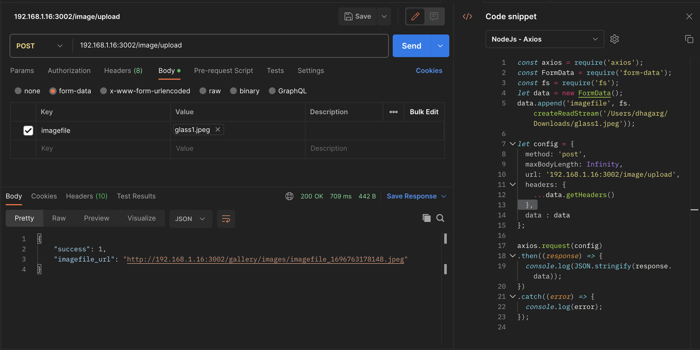

# lotus-bottle-art

Public REST APIs to get data
GET : /public
request body: 
{
    "pub_table":v1,
    "pub_criteria":v2,
    "pub_criteria_value":v3
}

type of v1,v2,v3 is string
Possible combinations of [v1,v2,v3] 
1: ["pub_lba_image","image_id",DB.image_id]
Result : select * from lba_image where image_id = <image_id>;

2: ["pub_lba_image","carousel_flag_Y","carousel_flag_Y"]
Result : select * from lba_image where carousel_flag = 'Y';

3: ["pub_lba_category","all","all"]
Result : select * from lba_category;

4: ["pub_lba_product","product_id",<product_id>]
Result : select * from lba_product where product_id = <product_id>;

5: ["pub_lba_product","category_id",<category_id>]
Result : select * from lba_product where product_deleted_flag = 'N' and category_id = <category_id>;

6: ["pub_lba_product","keyword",<input>]
Result : select * from lba_product where product_deleted_flag = 'N' and product_name like '%<input>%';

7: ["pub_lba_product_images","product_id",<product_id>]
Result : select * from lba_product_images where product_id = <product_id>;

Image Upload Rest Call:

